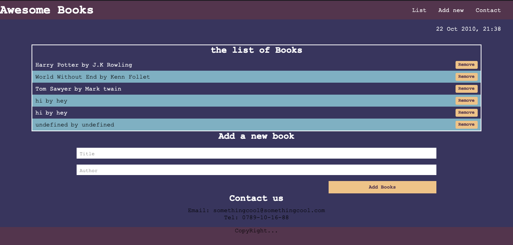
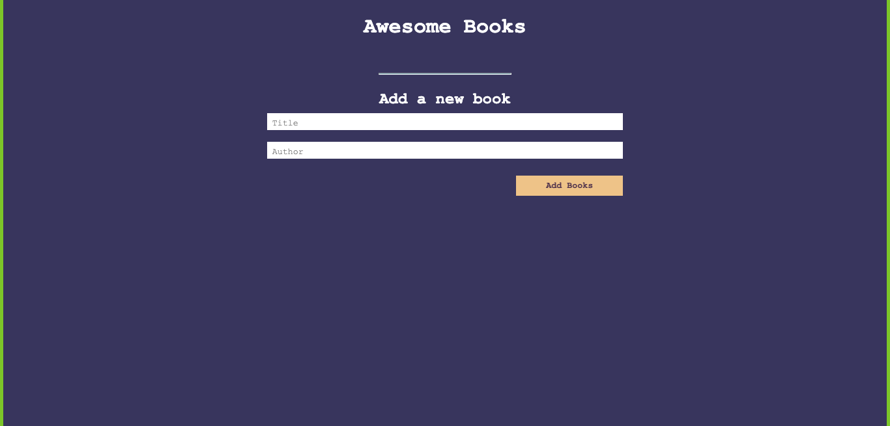
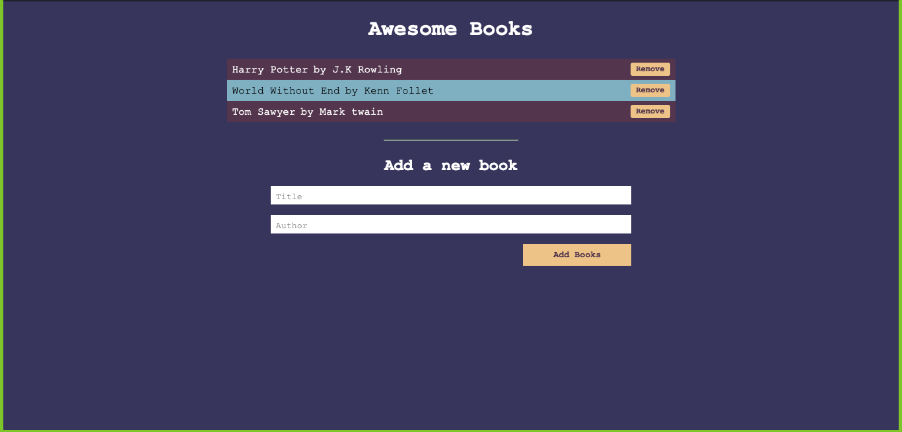

# Awesome Books Project


> A simple App that allows a user to efficiently organise all their books.





- A User can add a Book.
- A User can Remove a Book.

## Built With

- Javascript, HTML and CSS
## Getting Started

- In terminal or Command line. Navigate to a directory in your local storage where you'd like to store the project and paste ```https://github.com/emmyobonyo/AwesomeBooks.git```
- Navigate to the ```index.html``` file and open it in your favourite browser.

👤 **Amine Smahi**

- GitHub: [@medaminedev66](https://github.com/medaminedev66 )
- LinkedIn: [Amine Smahi](https://www.linkedin.com/in/mohammed-amine-smahi-1b8615187/)

👤 **EMmanuel Obonyo**

- GitHub: [@emmyobonyo](https://github.com/emmyobonyo)
- Twitter: [@emmyobonyo](https://twitter.com/emmyobonyo)
- LinkedIn: [Emmanuel Obonyo](https://www.linkedin.com/in/emmanuel-obonyo-3728a2200/)


## Show your support

Give a ⭐️ if you like this project!

## Acknowledgments

- Thanks to [Microverse](https://github.com/emmyobonyo)

## 📝 License

This project is [MIT](./MIT.md) licensed.
